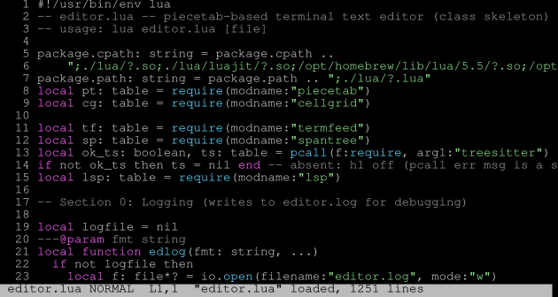

# 

[](https://github.com/starwing/piecetab/actions/workflows/test.yml) [](https://coveralls.io/github/starwing/piecetab?branch=master)

[English](README.md) | **中文**

多个轻量级 stb 风格单头文件 C89 库，用于构建高性能文本编辑器 buffer：

- **`piecetab.h`** — 基于 B+ 树的字节级 piece table，支持写时复制（COW）
  快照、事务化编辑、零拷贝读取。
- **`linecache.h`** — 计量 B+ 树（Metric B+ Tree），维护字节偏移 ↔ 行号
  映射，在高频编辑下保持行号缓存。
- **`undotree.h`** — 基于区间代数的版本图 + 编辑日志 + 差分服务，骑在
  `pt_Buffer` COW 快照之上。
- **`spantree.h`** — 字节属性染色 span 树：B+ 树保存全覆盖 `(len, id)`
  渲染结果段，支持 namespace mask、arbiter 回调与编辑同步操作。

所有库相互独立、可自由组合：piecetab 只存字节（"clean octet"——不管行、
不管编码），linecache 只管行断点，undotree 管理版本图并为任意两版本计算差分，
spantree 保存最终渲染染色 span（全覆盖字节属性段）。前三者组合即得支持
O(log n) 偏移 ↔ 行号双向导航和 undo/redo 的完整编辑器 buffer；spantree
在其上提供语法高亮、诊断等字节属性样式。

外围库将核心扩展为完整编辑器：

- **`cellgrid.h`** — 屏幕 buffer + diff 层：网格单元、滚动/移动/填充
  原语，以及用于高效屏幕更新的重绘差分驱动。
- **`termfeed.h`** — libtermkey 风格的终端输入状态机：原始字节 →
  解码按键（CSI/SS3、UTF-8、Alt 键、鼠标、OSC52）。

全部遵循同一 stb 风格布局：单头 C89 实现、`lua/` 下的 Lua 绑定、
`tests/` 下的测试文件。

## AI 使用
- 所有实现（stb 头文件）均为手写，AI 用于寻找解决方案、辅助设计和生成文档。
- 所有测试均由 AI 编写，人工review，用于验证实现的正确性，并确保代码满足需求和规范。
- `editor.lua` 由 AI 编写，用于演示库的使用，并为希望在自己的项目中使用库的开发者提供参考。

## 动机

本项目源于对**高性能、低延迟文本 buffer** 的需求——在高频编辑、大文件、
复杂内容下保持可预测的行为：

- 插入/删除负载下性能稳定
- 廉价快照，支撑 undo/redo 与异步消费者
- 紧凑的单头文件实现，便于嵌入

## 特性

### piecetab.h

- **不可变 Buffer + COW**：`pt_Buffer` 是带引用计数的快照；游标上的首次编辑
  fork 出私有 transient 树，`pt_commit` 冻结为新 Buffer，`pt_rollback` 丢弃
- **两种 piece**：零拷贝 *literal*（引用用户内存）与池化可变 *hole*
  （原位吸收小编辑）
- **事务化 OOM 安全**：编辑前预留池对象；返回 `PT_ERRMEM` 时结构保持
  一致，游标仍然有效
- **arena 直写 literal**：`pt_reserve` / `pt_scratch` / `pt_literal`
  将字节直接写入树的 arena，免二次拷贝
- **分代压缩**：每个编辑代独占自己的 arena；`pt_compact` 产出独立的
  紧凑新 Buffer——旧代持有的字节拷入紧凑新 arena，外部内存（如大文件
  mmap）原指针引用不拷贝，release 旧链即回收其全部内存

### linecache.h

- **计量 B+ 树**：每子树双计字节数与行数，双向 O(log n) 导航
- **批量加载**：`lc_scan` 通过 scanner 回调自底向上建树，远快于逐行插入
- **完整编辑**：单点行断插入（`lc_markbreak`）、区间删除（`lc_remove`）、
  删插字节（`lc_splice`）、中部文本插入（`lc_insert` / `lc_append`），
  全部支持 OOM 完整回滚

### undotree.h

- **版本图**：不可变快照树（`ut_Node`），每节点携带与 parent 的 changeset
  (hunk 列表) 和不透明 payload（如 `pt_Buffer`）
- **编辑日志**：未提交编辑以 `(off, del, ins)` 三元组暂存，commit 时规范化
  为 hunk 列表
- **Hunk 代数**：compose（X→Y ∘ Y→Z → X→Z）、取逆、规范化等区间变更运算
- **Fresh-vid 协议**：`ut_freshvid(S)` 哨兵表示未提交状态；
  `ut_diff(from, to)` 经四阶段 compose 处理任意 committed 版本 + fresh
  端点的组合

### spantree.h

- **全覆盖 span 模型**：保存最终渲染染色为 `(len > 0, attr id)` 段，
  渲染端零合成
- **arbiter 单层**：写入经 `sp_Arbiterf` 回调，外部决定混合/命名空间
  策略，树本身保持零格式知识
- **namespace mask**：节点级 `sp_Mask` 聚合支持按 ns 剪枝的
  `sp_next` / `sp_prev` / `sp_clear`（经 `sp_addns` / `sp_delns`）
- **编辑同步**：`sp_splice` / `sp_append` / `sp_insert` / `sp_remove`
  随文本编辑平移 span，重力确定（append 继承左、insert 继承右）
- **稀疏染色免费**：未染色字节即大段 id 0，无需树级偏移特殊机制

## 快速上手

所有库皆为 stb 风格：任意处包含头文件，在恰好一个编译单元中定义
`*_IMPLEMENTATION` 宏。

### piecetab.h

```c
#define PT_IMPLEMENTATION
#include "piecetab.h"

int main(void) {
    pt_State *S = pt_open(NULL, NULL);        /* 默认分配器 */
    pt_Buffer src, out;
    pt_Cursor C;
    char      buf[32];
    size_t    n;

    src = pt_from(S, "hello world", 11);      /* 零拷贝 buffer */
    pt_seek(&C, src, 5);
    pt_insert(&C, ",", 1);                    /* 引用语义 */
    out = pt_commit(&C);                      /* 冻结为新 buffer */

    pt_seek(&C, out, 0);
    n = pt_read(&C, buf, sizeof(buf));        /* "hello, world" */

    pt_release(src);
    pt_release(out);
    pt_close(S);
    return (int)n;
}
```

### linecache.h

```c
#define LC_IMPLEMENTATION
#include "linecache.h"
#include <string.h>

/* scanner 返回下一行长度（含 '\n'），返回 0 结束 */
static unsigned scan(void *ud, size_t pos) {
    const char **s = (const char **)ud;
    const char  *nl = strchr(*s, '\n');
    unsigned     len;
    (void)pos;
    if (nl == NULL) return 0;
    len = (unsigned)(nl - *s) + 1;
    *s += len;
    return len;
}

int main(void) {
    const char *text = "one\ntwo\nthree\n";
    lc_State *S = lc_open(NULL, NULL);
    lc_Cache *c = lc_newcache(S);
    lc_Cursor C;

    lc_scan(c, scan, &text);           /* 批量加载行断点 */
    lc_seekline(&C, c, 2);             /* 定位第 2 行行首 */
    /* lc_offset(&C) == 8, lc_breaks(c) == 3 */

    lc_close(S);                       /* 释放全部 cache */
    return 0;
}
```

### spantree.h

```c
#define SP_IMPLEMENTATION
#include "spantree.h"

/* arbiter：外部混合策略；这里简单保留新 id */
static sp_Id keep_new(void *ud, sp_Id id, sp_Id old, sp_Mask *mask) {
    (void)ud; (void)old; (void)mask;
    return id;
}

int main(void) {
    sp_State *S = sp_open(NULL, NULL);
    sp_Tree  *T = sp_newtree(S);
    sp_Cursor C;

    sp_setarbiter(T, keep_new, NULL);
    sp_seek(&C, T, 0);
    sp_fill(&C, 1, 3);            /* 字节 0..3 染 attr id 1 */
    sp_append(&C, 2);             /* 在光标处插入 2 字节      */
    /* sp_bytes(T) == 5 */

    sp_freetree(T);
    sp_close(S);
    return 0;
}
```

### editor.lua



#### 简介

`editor.lua` 是 AI 编写的模态编辑器 demo，将各库串联起来：piecetab/
linecache 文档 buffer（`pt.doc`）、cellgrid 屏幕 buffer、termfeed 终端
输入，以及 spantree 样式染色。`Ed.new(content?, term?, grid?)` 由字符串
构建编辑器，`Ed.open(filename, term?, grid?)` 加载文件；两者均接受注入
的 term/grid 对象（测试使用 fake）。它同时充当 C 模块孵化场——标注
`TODO(C)` 的辅助函数（字符移动、列计算）是晋升为 C 的候选。

语法高亮：打开 `.c`/`.h`/`.lua` 扩展名文件时，通过 `treesitter` Lua
绑定（见 `lua/treesitter.c`）启用 tree-sitter 高亮（keyword/string/
comment/function 样式）。`Ed:open_language(lang)` 可手动开启；编辑会
增量更新高亮。

#### 前置依赖 / 模块

- **Lua**：主运行时为 Lua 5.5，同时支持 LuaJIT 兼容验证。demo 按仓库
  根目录相对路径查找模块：`./lua/?.so`、`./lua/luajit/?.so` 与
  `./lua/?.lua`。
- **必需 C 模块**：`piecetab`、`cellgrid`、`termfeed`、`spantree` 与
  `json`（yyjson 绑定）。`json` 被 `lsp.lua` 依赖，而 `editor.lua`
  无条件加载 `lsp.lua`。
- **可选 `treesitter`**：通过 `pcall(require, "treesitter")` 加载，缺失时
  仅关闭高亮。完整高亮需要 `libtree-sitter` 与 `lua/grammar` 下的编译
  语法文件。
- **`lsp.lua`**：纯 Lua LSP 客户端，需要 `json` 绑定与 `luv`。文件配置
  了对应 server 时会自动启动 LSP。
- **仅测试需要**：`luaunit` 测试框架；部分编辑器/cellgrid/显示测试还
  需要 `lua-utf8` rock（仅 PUC Lua）与 `tmux`。

#### 安装 / 构建

在仓库根目录运行：

```sh
just lua/deps # 只构建运行 demo 所需的 C 模块（不跑测试）
just lua/ed   # 构建所需 C 模块并运行编辑器单元测试
```

`deps` recipe 会把 `piecetab`、`cellgrid`、`termfeed`、`json`、`spantree`
编译为 `lua/*.so`（PUC Lua），不运行测试。交互运行只需这些 `.so` 存在；
也可以单独构建，如 `just lua/json`、`just lua/sp`。LuaJIT 变体由通用
`just lua/build <name>` recipe 生成。

`lua/tests/editor_test.lua` 将 tree-sitter 视为可选：如果绑定或 C 语法
文件缺失，语法高亮相关测试会被跳过，因此 `just lua/ed` 在 clean 后也能
通过。需要高亮 demo 时可运行 `just lua/build-ts` 补上 tree-sitter。

#### just 命令

- `just lua/deps` — 构建 demo 所需的 PUC Lua 模块（不跑测试）
- `just lua/ed` — 构建所需模块并运行 `lua/tests/editor_test.lua`
- `just lua/ed-tmux` — 在真实 tmux 终端中运行显示集成测试
- `just lua/json` — 构建/测试 yyjson 绑定（`json`）
- `just lua/sp` — 构建/测试 spantree 绑定
- `just lua/ts` / `just lua/ts-grammars` — 构建/测试 tree-sitter 绑定；
  获取并编译语法
- `just lua/test` — 运行全部 Lua 测试套件（需要 lua-utf8、tmux、
  tree-sitter 语法）

#### 运行方法

```sh
lua editor.lua [file]
```

在构建好模块后于仓库根目录运行。不传 `[file]` 时以空 buffer 启动；传入
路径则编辑该文件。脚本进入 raw-mode 终端会话，使用 `:q` 或 `:wq` 退出。

```lua
local Ed = require("editor")

local e = Ed.open("file.txt")            -- 或 Ed.new("hello\nworld")
e:keymap("normal", "G", function(self)
  self.doc:seek("line", self.doc:breaks() - 1)
end)
e:command("hello", function(self, arg, bang)
  self.msg = "hello, " .. arg
end)
```

自定义按键/命令挂入各模式注册表（`mode` 为 `"normal"` / `"insert"`
/ `"command"`）。内置按键：`h/j/k/l`、`w/b`、`0/$`、`gg/G`、`x`、
`dd`、`i/a/o/O`、`u`/`<C-r>`、`:`；命令：`:w`、`:q`、`:wq`、`:e`。

单元测试：`just lua/ed`；交互 smoke：`lua editor.lua [file]`。

#### 语法高亮排查

demo 将 `treesitter` 视为可选模块，因此高亮缺失是静默降级而不是报错。
如果 `local`、`if`、`return` 等关键字没有着色，说明 tree-sitter 没有
成功加载。在 macOS 上，这些原生模块必须是针对本机构建的 Mach-O 文件；
从 Linux/CI 直接拷来的 `lua/treesitter.so`、`lua/luajit/treesitter.so`
或 `lua/grammar/*.so` 是 ELF 二进制，Lua 无法加载。

在仓库根目录重新构建本机原生模块（`just lua/ts` 也会获取并编译语法）：

```sh
just lua/ts   # 获取/编译 lua/grammar/*.so，构建 treesitter.so + luajit/treesitter.so 并测试
```

在 macOS 上确认二进制可用：

```sh
file lua/treesitter.so lua/luajit/treesitter.so lua/grammar/lua.so lua/grammar/c.so
```

输出应为 `Mach-O`（arm64/x86_64），而不是 `ELF`。`just lua/ed` 不会构建
tree-sitter，因此克隆仓库或把仓库拷到新机器后，请先运行一次 `just lua/ts`。

## API 总览

### piecetab.h

| 类别     | 函数                                                                                     |
| -------- | ---------------------------------------------------------------------------------------- |
| 生命周期 | `pt_open`, `pt_close`, `pt_reset`, `pt_getallocf`                                        |
| Buffer   | `pt_empty`, `pt_from`, `pt_compact`, `pt_retain`, `pt_release`                           |
| 查询     | `pt_bytes`, `pt_version`                                                                 |
| 游标     | `pt_seek`, `pt_locate`, `pt_advance`, `pt_offset`                                        |
| 读取     | `pt_read`, `pt_piece`, `pt_next`, `pt_prev`                                              |
| 编辑     | `pt_edit`（拷贝语义），`pt_insert` / `pt_append` / `pt_splice` / `pt_remove`（引用语义） |
| 事务     | `pt_commit`, `pt_rollback`                                                               |
| Arena    | `pt_reserve`, `pt_scratch`, `pt_literal`                                                 |

引用语义编辑（`pt_insert` 等）**不拷贝**输入字节——调用者须保证内存在
任何引用它的 Buffer 存活期间有效。`pt_edit` 拷贝进 hole piece（单次
`len <= PT_MAX_HOLESIZE`）。

### linecache.h

| 类别     | 函数                                                                                 |
| -------- | ------------------------------------------------------------------------------------ |
| 生命周期 | `lc_open`, `lc_close`, `lc_reset`                                                    |
| Cache    | `lc_newcache`, `lc_delcache`                                                         |
| 批量     | `lc_scan`                                                                            |
| 查询     | `lc_breaks`, `lc_bytes`                                                              |
| 游标     | `lc_seek`, `lc_seekline`, `lc_locate`, `lc_locline`, `lc_advance`, `lc_advline`      |
| 查询     | `lc_offset`, `lc_line`, `lc_col`, `lc_lineoffset`, `lc_linelen`                      |
| 编辑     | `lc_markbreak`, `lc_clearbreaks`, `lc_remove`, `lc_splice`, `lc_insert`, `lc_append` |

### undotree.h

| 类别     | 函数                                                                    |
| -------- | ----------------------------------------------------------------------- |
| 生命周期 | `ut_open`, `ut_close`, `ut_setcleaner`                                  |
| 树       | `ut_newtree`, `ut_deltree`                                              |
| Journal  | `ut_record`, `ut_unrecord`, `ut_freshcount`, `ut_discard`               |
| 版本     | `ut_commit`, `ut_switch`                                                |
| 导航     | `ut_root`, `ut_current`, `ut_parent`, `ut_payload`, `ut_childcount`     |
| 导航     | `ut_firstchild`, `ut_lastchild`, `ut_nextsib`, `ut_younger`, `ut_older` |
| 导航     | `ut_ancestor`                                                           |
| Diff     | `ut_freshvid`, `ut_diff`, `ut_freshdiff`, `ut_hunks`, `ut_mapoffset`    |

### spantree.h

| 类别     | 函数                                                |
| -------- | --------------------------------------------------- |
| 生命周期 | `sp_open`, `sp_close`                               |
| 树       | `sp_newtree`, `sp_freetree`, `sp_bytes`             |
| 混合     | `sp_setarbiter`, `sp_addns`, `sp_delns`, `sp_hasns` |
| 游标     | `sp_seek`, `sp_locate`, `sp_advance`, `sp_offset`   |
| 标记     | `sp_fill`, `sp_clear`                               |
| 读取     | `sp_next`, `sp_prev`, `sp_style`                    |
| 编辑     | `sp_splice`, `sp_append`, `sp_insert`, `sp_remove`  |

完整 API 参考见 [`docs/piecetab.zh.md`](docs/piecetab.zh.md)、
[`docs/linecache.zh.md`](docs/linecache.zh.md)、
[`docs/undotree.zh.md`](docs/undotree.zh.md) 与
[`docs/spantree.zh.md`](docs/spantree.zh.md)。

## Lua 绑定

每个 C 库在 `lua/` 下都有 Lua 绑定（`name.c` + `name.d.lua` 类型声明）。
此外还有纯 Lua / 仅元数据模块和 vendored JSON 绑定：

| 模块         | 源 / 文件                                     | 说明                                                                                 |
| ------------ | --------------------------------------------- | ------------------------------------------------------------------------------------ |
| `piecetab`   | `lua/piecetab.c`, `lua/piecetab.d.lua`        | `piecetab.h` 的 C 绑定（buffer、游标、文档）                                         |
| `cellgrid`   | `lua/cellgrid.c`, `lua/cellgrid.d.lua`        | `cellgrid.h` 的 C 绑定（屏幕网格 + diff）                                            |
| `termfeed`   | `lua/termfeed.c`, `lua/termfeed.d.lua`        | `termfeed.h` 的 C 绑定（终端输入）                                                   |
| `spantree`   | `lua/spantree.c`, `lua/spantree.d.lua`        | `spantree.h` 的 C 绑定（Compositor/Tree/Cursor span 染色）                           |
| `json`       | `lua/json.c`, `lua/json.d.lua`, `lua/yyjson/` | 基于 vendored yyjson 的纯 C 绑定（`decode`/`encode`/`array`/`object`/`null`/`type`） |
| `treesitter` | `lua/treesitter.c`, `lua/treesitter.d.lua`    | 基于 `libtree-sitter` 的 C 绑定（parser/tree/query API）                             |
| `lsp`        | `lua/lsp.lua`                                 | 纯 Lua LSP 客户端构建块；需要 `json` 与 `luv`                                        |
| `lua-utf8`   | `lua/lua-utf8.d.lua`                          | 仅为 `lua-utf8` rock 的类型声明（meta）                                              |

构建/测试 recipe 位于 `lua/justfile`，以 `just lua/<name>` 运行（如
`just lua/json`、`just lua/sp`、`just lua/ts`）。demo 的模块要求见
[`editor.lua`](#editorlua) 一节。

## 配置

在包含实现之前覆盖以下宏：

| 宏                                                                | 默认  | 含义                                                                         |
| ----------------------------------------------------------------- | ----- | ---------------------------------------------------------------------------- |
| `PT_FANOUT`                                                       | 31    | piecetab 节点最大子数                                                        |
| `LC_FANOUT` / `SP_FANOUT`                                         | 62    | linecache/spantree 节点最大子数                                              |
| `LC_LEAF_FANOUT`                                                  | 62    | 叶最大行数                                                                   |
| `PT_MAX_HOLESIZE`                                                 | 64    | hole piece 容量                                                              |
| `PT_MAX_LEVEL`                                                    | 17    | 最大树深 / 游标路径容量（见 [docs/max_levels.zh.md](docs/max_levels.zh.md)） |
| `LC_MAX_LEVEL` / `SP_MAX_LEVEL`                                   | 13    | 最大树深 / 游标路径容量（见 [docs/max_levels.zh.md](docs/max_levels.zh.md)） |
| `PT_PAGE_SIZE` / `LC_PAGE_SIZE` / `UT_PAGE_SIZE` / `SP_PAGE_SIZE` | 65536 | 池分配器页大小                                                               |
| `PT_ARENA_SIZE`                                                   | 1024  | arena 块最小容量                                                             |
| `PT_COMPACT_RANGES`                                               | 64    | compact 区间数组初始容量                                                     |

所有库均可在 `*_open` 时传入自定义分配器（`lc_Alloc` / `pt_Alloc`
/ `ut_Alloc` / `sp_Alloc`，Lua 风格 realloc 签名）。

## 目录结构

- `*.h` — stb 风格单头文件库（纯 C89，自包含）：`piecetab.h`、
  `linecache.h`、`undotree.h`、`spantree.h`、`cellgrid.h`、`termfeed.h`
- `lua/` — Lua 侧：每个库一个绑定 `name.c` + API 声明 `name.d.lua`，
  以及 `editor.lua` demo 和 `tests/`（Lua 测试）。绑定构建产物：
  `lua/*.so`（Lua 5.5，主运行时）与 `lua/luajit/*.so`（LuaJIT，兼容验证）
- `tests/` — C 测试：每个库一个 `*_test.c`；`tests.h`（共享 runner 与
  断言）、`gen_entries.lua`（测试条目生成器）、`lc_tests.h`
  （linecache 特有辅助，两个 fanout 变体共享）
- `docs/`、`notes/` — API 参考文档与设计记录

## 文档

- [`docs/piecetab.zh.md`](docs/piecetab.zh.md) — piecetab API 参考与实现笔记
- [`docs/linecache.zh.md`](docs/linecache.zh.md) — linecache API 参考与实现笔记
- [`docs/undotree.zh.md`](docs/undotree.zh.md) — undotree API 参考与集成指引
- [`docs/spantree.zh.md`](docs/spantree.zh.md) — spantree API 参考与实现笔记
- [`notes/`](notes/) — 设计文档：架构总览（`brief_*.md`）、算法设计
  （`design_*.md`）、区间删除算法演进史

外围库（`cellgrid.h`、`termfeed.h`）尚无 API 文档——参见各自
`lua/*.d.lua` 声明与 `notes/design_cellgrid.md`、`notes/design_termfeed.md`。

## 测试

测试以极小扇出（4）配合 ASan/UBSan 运行以逼树分裂，并有 lcov 覆盖率
构建。所有库均保持 **100% 行/函数覆盖**与约 90% 分支覆盖。

```sh
# C 测试（每库一个 runner）
just lc     # linecache 测试
just pt     # piecetab 测试
just ut     # undotree 测试
just sp     # spantree 测试
just cg     # cellgrid 测试
just tf     # termfeed 测试
just cov    # 覆盖率报告
just sp-cov # spantree 覆盖率报告
just sp-lines  # spantree 未覆盖行
just sp-unbranched  # spantree 未覆盖分支

# Lua 绑定测试 — just lua/<recipe> 执行 lua/justfile
just lua/pt  # piecetab 绑定（另有 lua/cg、lua/tf）
just lua/sp  # spantree 绑定
just lua/json  # yyjson 绑定
just lua/lsp  # 纯 Lua LSP 客户端测试（构建 json）
just lua/ed  # editor.lua 单元测试
just lua/ed-tmux  # 编辑器显示测试（需要 tmux）
just lua/ts  # treesitter 绑定测试
just lua/ts-cov  # treesitter 绑定覆盖率
just lua/ts-lines  # treesitter 未覆盖行
```

编码规范见 [CONTRIBUTING.md](CONTRIBUTING.md)。

## 基准测试

`bench/` 目录包含 piecetab 库族的 C89 基准测试框架。它以 public API 为维度、
使用确定性结构基数语料（piece/行/span 数量，而非文件字节数），并输出 JSON。

```sh
# 编译并运行默认 FANOUT 的 piecetab 基准
just bench/all

# 快速冒烟运行
just bench/smoke

# 完整 PT_FANOUT 扫描 4..63（64 排除：ptM_mask(64) 是 UB）
just bench/sweep

# 多 seed 确认扫描
just bench/confirm

# 绘制 JSON 结果（需要 matplotlib；无则回退 CSV/Markdown）
just bench/plot
```

可通过 `FANOUTS` 与 `BENCH_ROUNDS` 运行子集，例如
`FANOUTS="16 24 31" BENCH_ROUNDS=5 just bench/sweep`。原始 JSON 在
`bench/results/`，图表与摘要输出到 `bench/reports/`。调优报告在
`notes/reports/bench_tuning_pt.md`（本地/gitignored）；设计见
`notes/design_bench.md`。

## 许可证

[MIT](LICENSE)，与 Lua 相同。
